# 装修工作室Web应用原型架构设计

## 1. 项目概述

本文档描述了装修工作室Web应用原型的架构设计，该应用旨在提供一站式装修服务平台，包括需求收集、价格计算、智能设计分析等功能，重点关注快速原型开发与展示。

### 1.1 核心功能

**基本特性：**
- 需求收集表单（风格/材料清单/特殊需求等）
- 可视化价格计算器（根据面积/复杂度自动报价）
- 报价对比（不同方案成本分析）

**智能设计：**
- 在线户型诊断（上传户型图获取分析）
- AI风格测试（问卷生成偏好报告）
- AR空间预览（手机扫描房间实时渲染效果）

### 1.2 技术目标

- 现代化Web框架实现、部署快速简便
- 简洁架构（表示层、业务逻辑层、数据层）
- 支持接入大模型API
- 支持Docker一键部署
- 快速原型开发与展示

## 2. 系统架构

### 2.1 整体架构

采用简化的前后端分离架构设计：

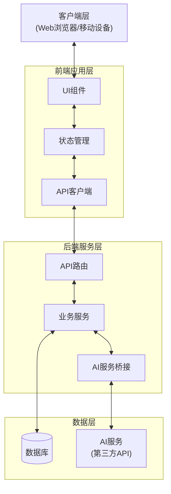

### 2.2 技术栈选择

#### 前端技术栈
- **框架**: React.js
- **UI库**: Material-UI / Ant Design
- **状态管理**: Redux Toolkit
- **路由**: React Router
- **构建工具**: Vite
- **AR实现**: AR.js / Three.js

#### 后端技术栈
- **框架**: Node.js + Express.js
- **数据库**: MongoDB (快速原型阶段)
- **AI集成**: OpenAI API / 其他大模型API适配器

#### DevOps
- **容器化**: Docker
- **配置管理**: Docker Compose

## 3. 详细设计

### 3.1 前端架构

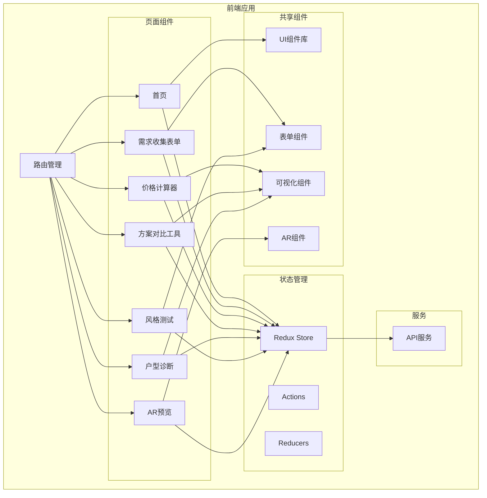

### 3.2 后端架构

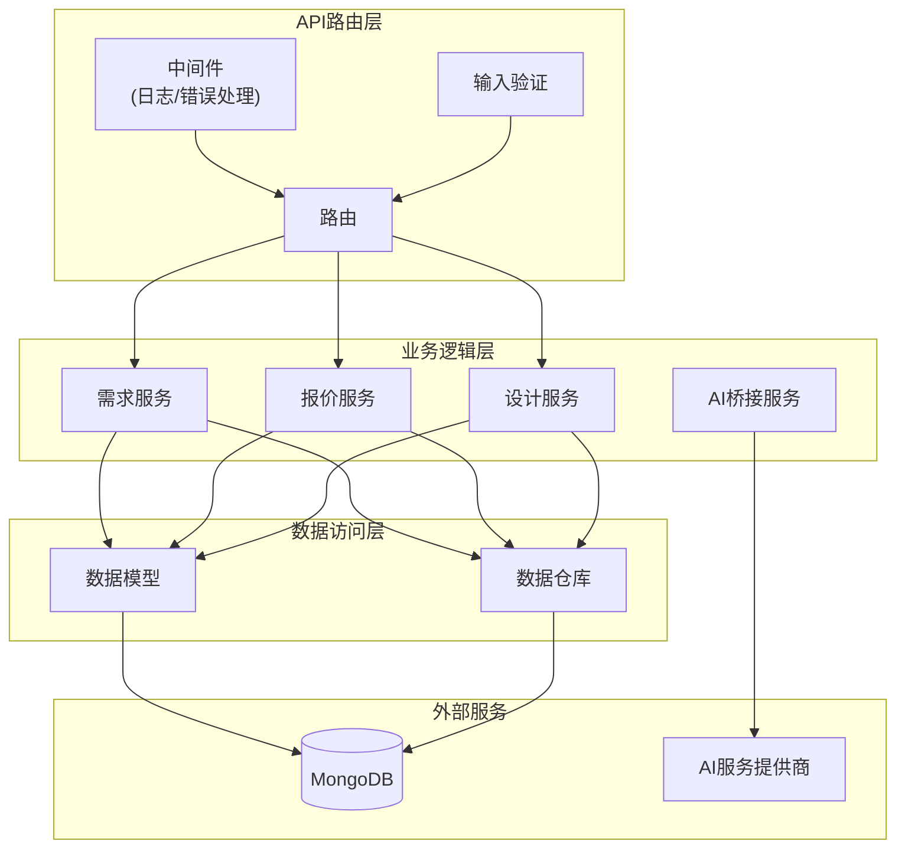

### 3.3 数据模型

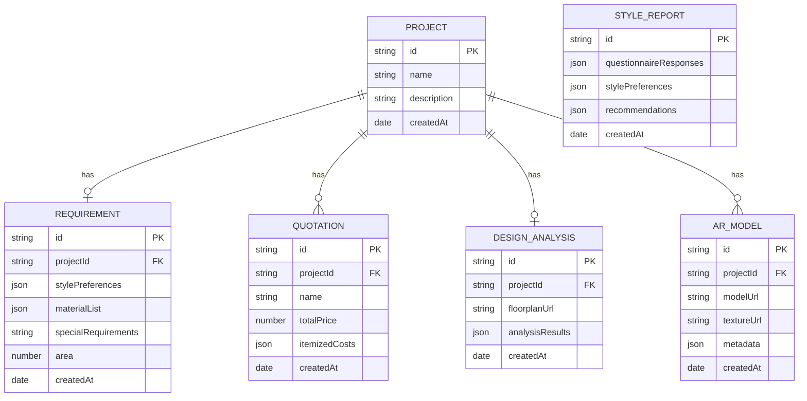

## 4. 功能模块设计

### 4.1 需求收集表单

**功能描述**：用户填写装修需求的表单，包括风格偏好、材料选择、特殊需求等。

**表单结构**：
1. **基本信息**
   - 房屋面积（平方米）
   - 房型（几室几厅）
   - 装修预算范围
   - 期望完工时间

2. **风格偏好**
   - 装修风格选择（现代简约、北欧、中式、美式、工业风等）
   - 色彩倾向（冷色调、暖色调、中性色调）
   - 参考图片上传（用户可上传喜欢的装修效果图）

3. **材料选择**
   - 地面材料（木地板、瓷砖、大理石等）
   - 墙面材料（乳胶漆、壁纸、硅藻泥等）
   - 厨卫材料（橱柜台面、洁具等）
   - 门窗材料（实木门、复合门等）

4. **功能需求**
   - 收纳需求（高/中/低）
   - 照明需求（自然光/人工光偏好）
   - 智能家居需求（智能照明、智能安防等）
   - 特殊功能区（书房、健身区、影音区等）

5. **特殊需求**
   - 老人/儿童适老化设计需求
   - 宠物友好设计需求
   - 环保材料需求
   - 其他特殊要求（文本框自由填写）

**关键组件**：
- 多步骤表单UI（分步引导用户完成）
- 实时表单验证
- 材料选择器（带预览图和简要说明）
- 风格选择器（带图片参考和风格特点说明）
- 预算估算提示（根据已选项目给出预估范围）

**数据流**：
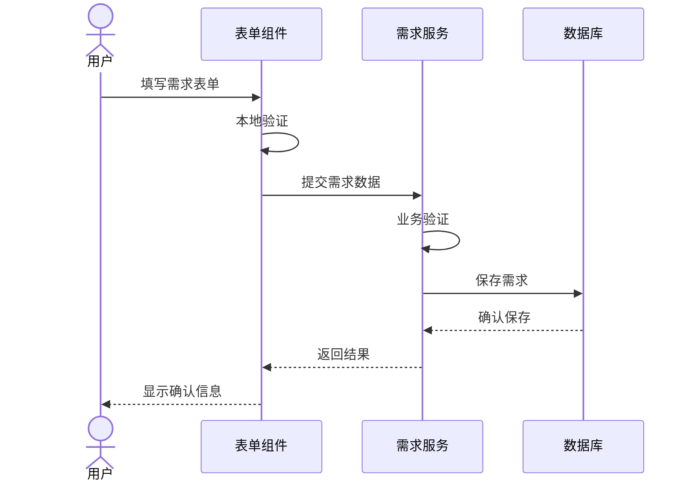

### 4.2 价格计算器

**功能描述**：根据用户输入的面积、选择的材料和装修复杂度，自动计算装修预算。

**关键组件**：
- 交互式计算器UI
- 实时价格更新
- 材料价格数据库
- 报价明细生成器

**计算逻辑**：
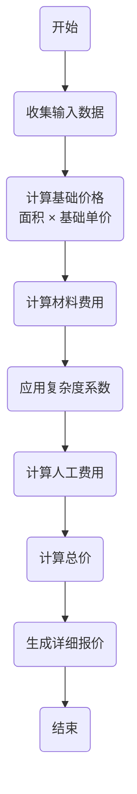

### 4.3 户型诊断

**功能描述**：用户上传户型图，系统利用AI分析户型特点并提供优化建议。

**关键组件**：
- 图片上传组件
- 图像处理服务
- AI分析引擎
- 可视化结果展示

**处理流程**：
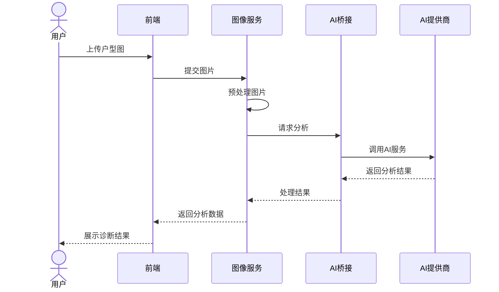

### 4.4 AI风格测试

**功能描述**：通过问卷形式了解用户偏好，利用AI生成个性化风格报告。

**关键组件**：
- 交互式问卷
- 风格偏好算法
- AI推荐引擎
- 可视化风格报告

**数据处理**：
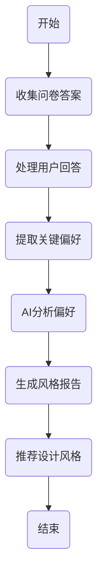

### 4.5 AR空间预览

**功能描述**：用户通过手机扫描房间，实时渲染装修效果。

**关键组件**：
- AR.js/Three.js集成
- 3D模型加载器
- 空间识别算法
- 材质渲染引擎

**技术流程**：
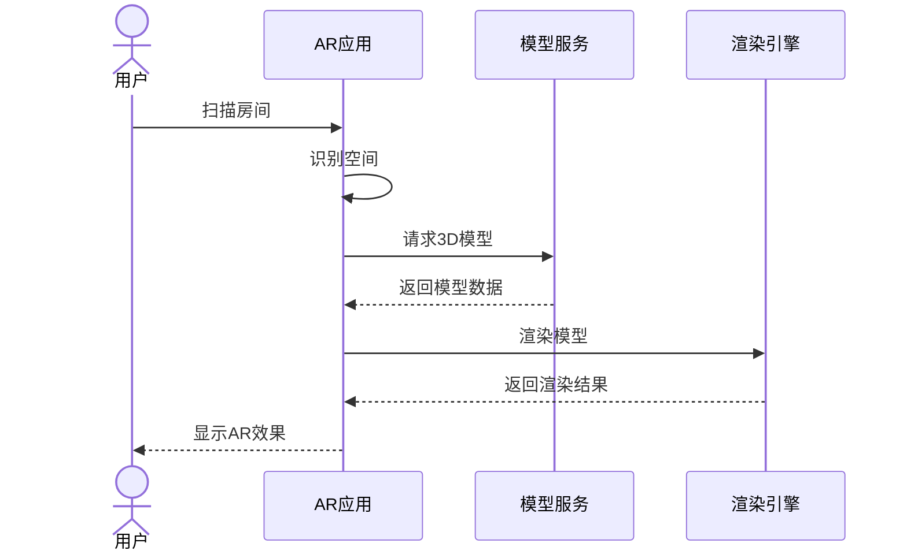

## 5. AI服务集成

### 5.1 AI服务桥接架构

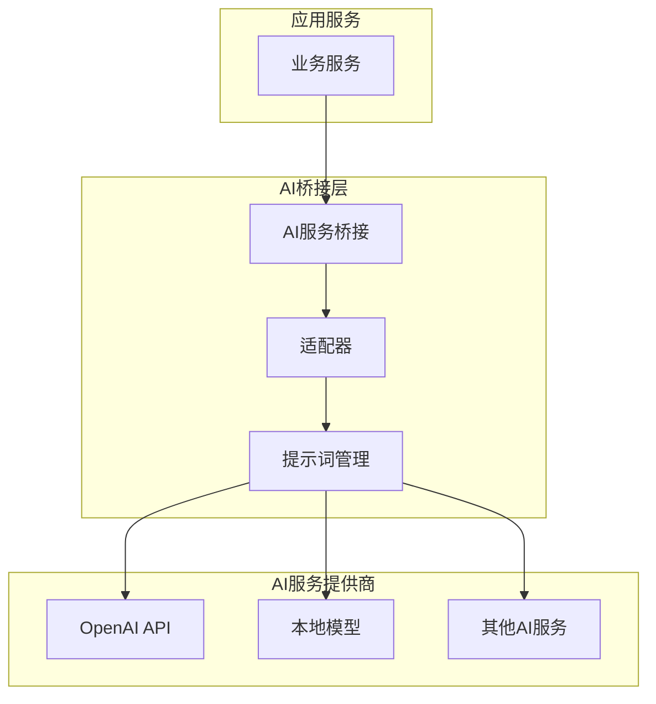

### 5.2 AI功能映射

| 功能模块 | AI服务类型 | 用途 |
|---------|-----------|------|
| 户型诊断 | 计算机视觉 + LLM | 分析户型图，识别空间布局，提供优化建议 |
| 风格测试 | LLM | 分析用户偏好，生成个性化风格报告 |
| 价格计算 | 结构化数据 + LLM | 根据项目参数智能估算成本 |
| AR预览 | 计算机视觉 + 3D渲染 | 空间识别与虚拟家具放置 |

## 6. 部署架构

### 6.1 Docker部署结构

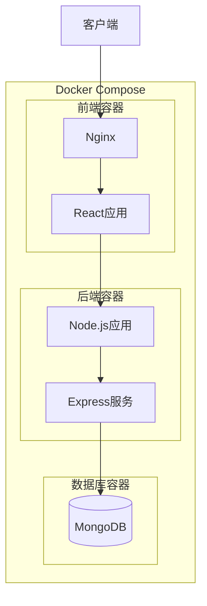

### 6.2 部署配置

**docker-compose.yml 结构**：
```yaml
version: '3'
services:
  frontend:
    build: ./frontend
    ports:
      - "80:80"
    depends_on:
      - backend
  
  backend:
    build: ./backend
    ports:
      - "3000:3000"
    depends_on:
      - mongodb
    environment:
      - MONGODB_URI=mongodb://mongodb:27017/decoration
      - AI_API_KEY=${AI_API_KEY}
  
  mongodb:
    image: mongo:latest
    volumes:
      - mongo-data:/data/db
    ports:
      - "27017:27017"

volumes:
  mongo-data:
```

## 7. 原型开发计划

### 7.1 优先级划分

1. **第一阶段（核心功能）**
   - 需求收集表单
   - 价格计算器
   - 基础用户界面

2. **第二阶段（增强功能）**
   - 报价对比工具
   - AI风格测试（基础版）
   - 户型诊断（基础版）

3. **第三阶段（高级功能）**
   - AR空间预览
   - 高级AI功能

### 7.2 快速原型开发路线图

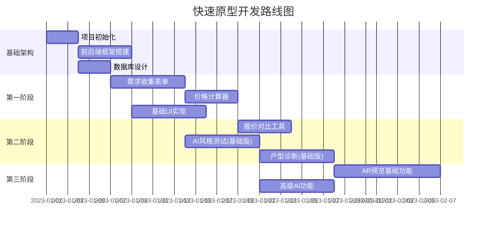

## 8. 技术风险与缓解策略

| 风险 | 影响 | 缓解策略 |
|------|------|---------|
| AI API成本高 | 运营成本增加 | 实现本地缓存、批处理请求、设置使用限额 |
| AR兼容性问题 | 用户体验受限 | 提供降级方案，如2D预览模式 |
| 技术复杂度 | 开发延期 | 模块化设计、优先实现核心功能 |

## 9. 总结

本架构设计文档提供了装修工作室Web应用原型的精简设计方案，聚焦于快速原型开发与展示。采用现代化的前后端分离架构，结合AI技术，实现从需求收集到智能设计分析的装修服务平台。

设计重点关注：
1. 核心功能优先实现
2. 简化架构，快速部署
3. AI服务灵活集成
4. 用户体验优先，提供直观的交互界面
5. 快速原型迭代 